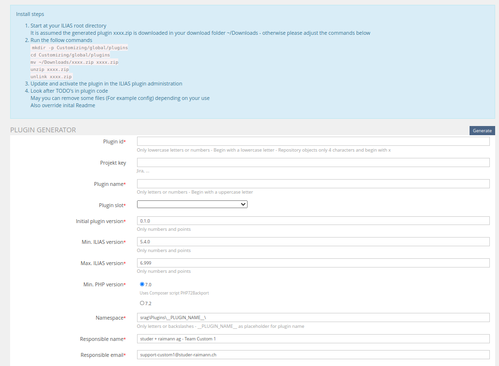
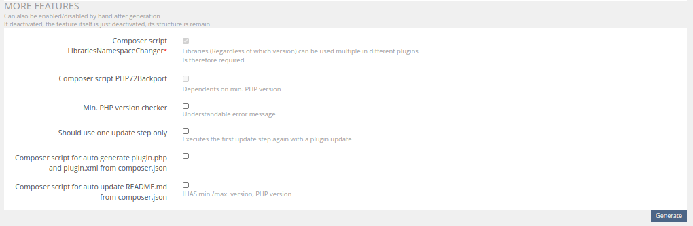

<!-- Autogenerated from composer.json - All changes will be overridden if generated again! -->

# SrPluginGenerator ILIAS Plugin

srag ILIAS plugin generator

This is an OpenSource project by studer + raimann ag, CH-Burgdorf (https://studer-raimann.ch)

This project is licensed under the GPL-3.0-only license

## Installation

Start at your ILIAS root directory

```bash
mkdir -p Customizing/global/plugins/Services/UIComponent/UserInterfaceHook
cd Customizing/global/plugins/Services/UIComponent/UserInterfaceHook
git clone https://github.com/studer-raimann/SrPluginGenerator.git SrPluginGenerator
```

Update, activate and config the plugin in the ILIAS Plugin Administration

## Description

Please ensure `composer` is installed on your server

Generates ILIAS base plugins and deliver as download as ZIP file

You can access plugin generator from the main menu entry or with the follow static url
```
https://your-domain/goto.php?target=uihk_srplugingenerator
```

This plugin is installed at : https://plgen.studer-raimann.ch

Form:




## Requirements

* ILIAS 5.4.0 - 6.999
* PHP >=7.0

## Adjustment suggestions

* External users can report suggestions and bugs at https://plugins.studer-raimann.ch/goto.php?target=uihk_srsu_PLUGGEN
* Adjustment suggestions by pull requests via github

## ILIAS Plugin SLA

We love and live the philosophy of Open Source Software! Most of our developments, which we develop on behalf of customers or on our own account, are publicly available free of charge to all interested parties at https://github.com/studer-raimann.

Do you use one of our plugins professionally? Secure the timely availability of this plugin for the upcoming ILIAS versions via SLA. Please inform yourself under https://studer-raimann.ch/produkte/ilias-plugins/plugin-sla.

Please note that we only guarantee support and release maintenance for institutions that sign a SLA.
